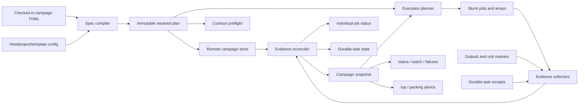

# remoteslurm v3 — campaign workspaces

## Purpose

remoteslurm already makes individual Slurm operations feel local: it keeps an authenticated
connection warm, exposes bounded structured operations, submits arrays and packed jobs, reconciles
ordinary jobs across scheduler views, and can give one computation a durable identity with
`ensure`.

The next layer should make a scientific campaign feel like one durable project. A campaign is not
just a label applied to a set of jobs. It is a versioned plan containing work units, stage
dependencies, execution environments, output contracts, and validation rules, together with the
evidence accumulated while that plan runs.

The feature must be useful beyond any one project or cluster. It must support:

- single jobs, arrays, packed allocations, and jobs submitted outside remoteslurm;
- subject/session pipelines, parameter sweeps, simulation ensembles, and aggregate stages;
- new campaigns and adoption of work that is already running;
- clusters with short accounting retention, MFA, shared-filesystem delays, and older Slurm;
- incomplete and failed campaigns without dropping work units or weakening their contracts.

The central interface is:

```bash
rslurm campaign status analysis
```

but the underlying deliverable is a campaign model and evidence system shared by status,
validation, execution, monitoring, and resource interpretation.

## Implementation checkpoint — 2026-09-15

The repository now contains the usable observation-first vertical slice: strict schema-v1
compilation, shared scheduler evidence reconciliation, a remote compare-and-swap store, immutable
definitions and run records, paged committed snapshots and events, job/array/output adoption,
bounded refresh, independent state axes, lifecycle transitions, current telemetry coverage, and
Python/CLI/MCP surfaces.

This is an implementation checkpoint rather than a claim that every WP0–WP3 qualification gate is
closed. Store rebuild/compaction and orphan-retention commands, the exhaustive injected-crash and
concurrent-writer matrix, and the live SAM adoption comparison remain release gates. WP4 and later
still own contract preflight, managed execution, project exploration/deployment, reconnection, and
packing advice.

## Decisions fixed by this plan

1. **Campaign state is durable on the remote system.** A laptop-local job registry is a cache and
   recovery aid, not the campaign source of truth.
2. **Intent is immutable within a run.** Editing a campaign file creates a new definition revision;
   it never silently changes the meaning of existing attempts or receipts.
3. **A status read is observation-only.** It may query Slurm and inspect bounded metadata, but it
   never submits, retries, cancels, or runs command validators.
4. **Execution, artifacts, and validation are separate evidence axes.** Scheduler `COMPLETED` does
   not imply valid output, and missing fresh scheduler data does not erase retained terminal or
   validation evidence.
5. **Planning precedes mutation.** The same resolved plan is shown by `campaign plan`, stored by
   `campaign start`, and consumed idempotently by `campaign apply`.
6. **Existing work is first-class.** Adoption uses the same job bindings and output contracts as
   remoteslurm-submitted work, with explicit limits on what can be inferred.
7. **Arrays and packed jobs are execution strategies, not campaign structure.** The campaign is
   expressed in stages and work units; an executor decides how those units share allocations.
8. **Validation contracts are reusable.** Preflight, pilot checks, production verification, and
   later revalidation execute the same contract against different declared roots or work units.
9. **Advice is evidence-bearing and advisory.** Resource recommendations include sample coverage,
   calculations, and limitations. They never resize or resubmit work automatically.
10. **Cluster policy stays outside the package.** Campaigns may refer to configured hosts,
    projects, templates, and environment profiles, while the resolved plan records exactly what
    those references meant for a particular run.

## Terms and identities

| Term | Meaning | Identity |
|---|---|---|
| Campaign | A stable human-facing workflow name, such as `analysis` | name within a host |
| Definition | A fully resolved immutable campaign plan | SHA-256 of canonical plan JSON |
| Run | One realization of a definition | server-assigned run id plus definition id |
| Stage | A node in the campaign DAG | stable stage name within a definition |
| Work unit | One logical item in a stage, such as one subject/session | stage plus canonical key fields |
| Job group | A scheduler submission covering one or more work units | durable submission marker |
| Attempt | One execution attempt for a unit or job group | immutable attempt id |
| Contract | Expected artifacts and validators for a unit or stage | SHA-256 of canonical contract JSON |
| Receipt | Retained evidence from validation or deployment | immutable content and evidence ids |

This table fixes the vocabulary, not every record schema in WP0. WP0 stabilizes campaign names,
definition identity, inventories, stages, work units, dependency joins, canonical versioning, and
the extension points used by later packages. WP1 stabilizes the shared observation envelope.
Attempt/job-group records are finalized in WP5, contract/validation receipts in WP4, store records
in WP2, and public campaign snapshots in WP3. Earlier packages may use private draft types for
later concepts, but those types are not exported or written as durable version-1 records.

The logical campaign name remains stable across edits. The definition id changes when resolved
scripts, work units, resources, environment declarations, dependencies, or output contracts
change. A run always points to exactly one definition. This gives users a natural name while
preventing a changed file from rewriting history.

Work-unit ids are deterministic:

```text
unit_id = sha256(canonical_json({stage, key}))
```

The complete digest is stored. A short prefix may be displayed only when it is unambiguous.
Scheduler attempts use a separate random id because retries must not change the work-unit identity.

## Architecture



The shared scheduler-evidence layer sits at the package root because ordinary jobs, durable tasks,
and campaigns all consume it. Campaign code may import the core evidence layer; the core layer must
not import campaign types.

```text
src/remoteslurm/
  evidence.py       observations, provenance, source availability, identity confidence
  reconcile.py      pure per-job reconciliation and compatibility projections

src/remoteslurm/campaigns/
  model.py          campaign definitions, runs, stages, units, and JSON forms
  spec.py           TOML parsing and schema validation
  plan.py           inventory expansion, DAG compilation, canonical identity
  store.py          store interface and remote file-backed implementation
  snapshot.py       stage aggregation, dependency readiness, and next-action selection
  contracts.py      output contracts, settling, validation receipts
  execution.py      idempotent apply/retry/cancel planning
  executors.py      single, array, pack, and adopted bindings
  deployment.py     content-addressed source snapshots
  telemetry.py      campaign resource aggregation and advice
  render.py         stable human and JSON projections
```

The dependency direction is:

```text
Slurm parsers -> evidence/reconcile -> jobs, durable tasks, campaigns
campaign model/store -> campaign snapshot, contracts, execution, telemetry
```

The remote stub remains a Python 3.6-compatible, standard-library-only mechanism. It gains bounded
storage, batch observation, filesystem scanning, and atomic transaction primitives. Campaign
policy, state derivation, and advice remain in the client.

## Campaign specification

### General shape

The checked-in specification is TOML and begins at schema version 1. This example is illustrative
of the grammar; none of the names or paths are built into remoteslurm.

Local inventory, script, validator, and lockfile paths resolve relative to the campaign file unless
they name a configured project path explicitly. Remote output paths resolve under `output_root`.
Remote roots may use `~` and environment variables exported by the remote login environment; the
resolved absolute roots become part of the immutable plan.

```toml
schema = 1
name = "analysis"
host = "mycluster"
project = "study-code"

[workspace]
remote_root = "$WORK/study"
output_root = "$WORK/study/derivatives"
deployment = "snapshot"             # snapshot | mutable

[inventories.participants]
source = "config/participants.tsv"
format = "tsv"
key = ["subject", "session"]

[inventories.group]
rows = [{ group = "all" }]
key = ["group"]

[environments.standard]
template = "cpu"
declaration = { modules = ["python/3.11"], lockfile = "uv.lock" }

[stages.preprocess]
foreach = "participants"
script = "scripts/preprocess.sh"
environment = "standard"

[stages.preprocess.execution]
mode = "array"
max_concurrent = 16

[stages.preprocess.resources]
time = "04:00:00"
cpus_per_task = 8
mem = "32G"

[[stages.preprocess.outputs]]
name = "product"
kind = "file"
alternatives = [
  { path = "sub-{subject}/ses-{session}/result.json", when_present = ["session"] },
  { path = "sub-{subject}/result.json", when_absent = ["session"] },
]
cardinality = "exactly_one"
min_bytes = 1
settle_timeout = 60
stable_for = 5

[[stages.preprocess.validators]]
kind = "command"
argv = ["python", "scripts/check_result.py", "{output:product}"]
timeout = 300

[stages.model]
foreach = "participants"
script = "scripts/model.sh"
environment = "standard"

[[stages.model.needs]]
stage = "preprocess"
on = ["subject", "session"]
require = "verified"

[[stages.model.outputs]]
name = "fit"
kind = "file"
alternatives = [
  { path = "models/sub-{subject}/ses-{session}/fit.rds", when_present = ["session"] },
  { path = "models/sub-{subject}/fit.rds", when_absent = ["session"] },
]
cardinality = "exactly_one"
min_bytes = 1

[stages.group]
foreach = "group"
script = "scripts/group.sh"
environment = "standard"

[[stages.group.needs]]
stage = "model"
on = []                              # all matching upstream units: a stage barrier
require = "verified"

[[stages.group.outputs]]
name = "summary"
kind = "file"
path = "group/summary.json"
min_bytes = 1

[pilots.small]
inventory = "participants"
select = { subject = ["001", "002"] }
output_root = "$WORK/study/pilot-derivatives"
```

### Parsing and canonicalization

- Unknown keys fail closed and include the exact table path in the error.
- Campaign, inventory, environment, and stage names match
  `[A-Za-z][A-Za-z0-9_.-]{0,63}`. The store never derives a writable path from unchecked text.
- Inventory values are strings, integers, finite floats, or booleans. An absent field represents an
  optional dimension; TOML has no null literal. JSON inventory nulls normalize to an absent field.
  Nested arbitrary data is not accepted in v1.
- TSV and JSON inventories are local inputs. Their bytes and normalized rows are fingerprinted into
  the definition. Row order is normalized; duplicate keys are an error.
- Placeholders use a small, enumerated grammar: `{field}` for inventory values and
  `{output:name}` for a resolved named output. No Jinja, Python expressions, command substitution,
  or implicit environment expansion is permitted.
- A value substituted into a path must be one safe path segment: non-empty, not `.` or `..`, and
  containing no slash, backslash, or NUL. Values passed as argv elements may contain other text but
  never NUL. Parameters reach job scripts through JSON rather than shell interpolation.
- `when_present` and `when_absent` support optional dimensions without an expression language.
- An unresolved placeholder, unused required key, duplicate unit id, duplicate stage name, output
  path collision, or dependency with no matching upstream unit fails at plan time.
- Paths are normalized lexically during compilation and resolved remotely during preflight. A path
  escaping the declared workspace or output root requires an explicit `external = true` declaration.
- Scripts, validators, inventories, lockfiles referenced by the environment declaration, and local
  workspace manifests are content-fingerprinted.
- Host defaults and named templates are resolved before hashing. CLI overrides are displayed in the
  plan and included in the definition id; there are no identity-invisible overrides.
- Canonical JSON uses sorted keys, UTF-8, explicit nulls, and no non-finite numbers. Canonicalization
  has golden tests so later releases cannot silently change existing ids.

### Inventories and dependency joins

An inventory defines a finite set of key-value rows. Every stage selects one inventory. A singleton
or aggregate stage uses a one-row inline inventory.

Each `needs` edge joins downstream units to upstream units using equal values for the listed `on`
keys:

- `on = ["subject", "session"]` gives a one-to-one or one-to-many per-session dependency.
- `on = ["subject"]` gives a subject-level fan-in across sessions.
- `on = []` makes every downstream unit depend on every upstream unit in that stage.

All matching upstream units must meet `require`, which is one of `completed`, `outputs_present`, or
`verified`. The default is `verified`. A join that matches no unit is a compile error unless the
edge explicitly declares `allow_empty = true`.

Arbitrary join expressions, renamed keys, dynamic inventories generated by earlier jobs, and cycles
are outside schema v1. They can be introduced later by adding explicit schema constructs rather
than embedding a programming language in TOML.

### Environments and resources

An environment has two related records:

- the **execution configuration**: named template, generated preamble/epilogue, container launcher,
  working directory, and environment variables;
- the **identity declaration**: modules, container digest, lockfile hashes, application versions,
  or other user-supplied values that contribute to the definition id.

The resolved run stores both. A declaration is never presented as runtime observation. Optional
preflight probes may record observed module, executable, container, and version evidence separately.

Resource precedence is:

```text
host defaults < named template < environment < stage < explicit plan override
```

The fully merged Slurm options are frozen into the definition. Account and partition may remain in
local host configuration for portability, but their resolved values are retained in the run.

## Durable campaign store

### Location and ownership

`HostConfig` gains `campaign_dir`. Its default is `~/.remoteslurm/campaigns`; sites whose home is not
shared must configure a durable shared location such as `$WORK/.remoteslurm/campaigns`.
`doctor` verifies ownership, permissions, atomic rename, compute-node visibility when a live test is
requested, and sufficient path expansion.

The store layout is an implementation detail behind a `CampaignStore` interface, but the initial
file-backed format is intentionally inspectable:

```text
<campaign_dir>/<safe-name>/
  definitions/<definition-id>.json
  runs/<run-id>/
    run.json
    HEAD
    journal/<revision>-<transaction-id>.json
    transactions/<transaction-id>/...
    orphaned/<transaction-id>/...
    views/<revision>-<transaction-id>/summary.json
    views/<revision>-<transaction-id>/index.json
    shards/<stage>/<shard>/<revision>-<transaction-id>.json
    receipts/preflight/<receipt-id>.json
    receipts/validation/<receipt-id>.json
    receipts/deployment/<deployment-id>.json
    telemetry/<job-group>/<page>.json
```

Definitions, committed journal records, and receipts are immutable. Mutable unit state is
reconstructed from committed events. Materialized summaries and sharded unit records are derived
indexes.

### Transaction and crash model

The stub exposes a generic bounded transaction primitive rather than campaign-specific policy:

1. Acquire an owned directory lock with stale-owner detection, following the durable-task pattern.
2. Compare the caller's expected `HEAD` revision.
3. Create a unique transaction directory and stage a bounded ordered event batch, changed shards,
   summary, and view index there. Record content digests and the idempotency key.
4. Verify the staged digests, then publish revision-and-transaction-named journal, shard, and view
   files with atomic renames. The journal record names its parent committed `HEAD` pointer.
5. Advance `HEAD` last, as an atomic `{revision, transaction_id}` pointer, so readers can discover
   the complete new revision.
6. Record the committed transaction result and release the lock.

Only revision/transaction pairs reachable from `HEAD` by following journal parent links are
committed history.
Published or staged files that are not reachable from `HEAD` are orphan transaction material, not
immutable campaign events. A lost caller may recover the same transaction by idempotency key and
finish it only when every digest and expected parent match.

Another writer never silently deletes an orphan. It moves stale transaction material to
`orphaned/<transaction-id>` after recording why it is unreachable. An explicit maintenance command
may collect quarantined material older than a configured age. Committed journal records and
receipts are never removed by orphan cleanup. Journal compaction creates an immutable checkpoint
and archive manifest; it does not turn unreachable files into history or discard evidence without
an explicit retention operation.

Summary counts are therefore exact at a committed revision, while detailed unit records remain
paged and bounded. A repair command can rebuild every materialized file from immutable definition,
binding, attempt, and evidence events.

The first implementation must define limits for:

- maximum expanded units per definition, with an explicit override for larger plans;
- event and shard bytes per transaction;
- returned units and bytes per page;
- journal compaction size;
- retained telemetry samples.

No command may load an unbounded campaign into one stub response or MCP result.

### Run and event records

`run.json` contains immutable creation metadata: campaign name, run id, definition id, creation
time, creator, host identity, control-plane identity, and optional parent run. Open/closed lifecycle
is derived from committed `run_started` and `run_closed` events.

Events are typed and schema-versioned. Initial event types are:

- `run_started`, `run_closed`, `run_archived`, `run_restored`;
- `job_group_intended`, `job_group_accepted`, `job_group_recovered`, `job_group_rejected`;
- `unit_attempt_bound`, `unit_attempt_started`, `unit_attempt_finished`;
- `scheduler_observed`, `artifact_observed`, `validation_recorded`;
- `job_adopted`, `durable_task_linked`;
- `preflight_recorded`, `deployment_bound`;
- `telemetry_sampled`;
- `attempt_retry_authorized`, `job_cancelled`;
- `evidence_conflict_recorded`, `operator_note`.

Events carry actor, time, definition id, run id, stage/unit/attempt identifiers as applicable, and
the source payload or receipt reference. Source evidence is retained; reconciliation does not
rewrite an old observation into a new meaning.

### Run closure and archival

A run has three lifecycle states:

- **Open** — `apply`, adoption, retry authorization, validation, refresh, and cancellation are
  permitted according to their normal policies.
- **Closed** — no new job group, attempt, adoption, deployment binding, or retry may be added.
  Status refresh, late scheduler/accounting evidence, artifact observation, revalidation, operator
  notes, and cancellation of an already-bound active job remain permitted. Closing means execution
  intent is finished; it does not mean the campaign passed.
- **Archived** — the run is hidden from normal listings and no longer accepts refresh, telemetry,
  or validation work. Its committed snapshot, journal, and receipts remain readable by explicit run
  id. `campaign restore` returns it to **Closed**, never directly to **Open**. New execution requires
  a new run, preserving the original definition and closure boundary.

`campaign close` refuses by default while any attempt is `INTENDED`, `PENDING`, `RUNNING`, or
`UNKNOWN`. `--allow-active` permits an operational handoff while recording the unresolved attempts
and reason in `run_closed`; it does not cancel them. `campaign archive` requires a closed run and
always refuses `INTENDED`, `PENDING`, or `RUNNING` attempts. It also refuses `UNKNOWN` unless
`--accept-unresolved` is given for irrecoverable history; the archived snapshot then permanently
lists those unresolved attempts as a limitation.

Neither close nor archive deletes scheduler records, outputs, deployments, events, or receipts.
Close and archive are idempotent by run id. Their human and JSON results state the lifecycle
transition, unresolved counts, and operations that remain available.

## Evidence and reconciliation

### Separate state axes

Every work-unit snapshot contains at least these axes:

| Axis | States |
|---|---|
| Dependency | `NOT_APPLICABLE`, `BLOCKED`, `SATISFIED`, `CONFLICT` |
| Execution | `UNBOUND`, `INTENDED`, `PENDING`, `RUNNING`, `COMPLETED`, `FAILED`, `CANCELLED`, `UNKNOWN` |
| Artifacts | `UNCHECKED`, `SETTLING`, `PRESENT`, `MISSING`, `CHANGED`, `ERROR` |
| Validation | `NOT_RUN`, `PASSED`, `FAILED`, `STALE`, `ERROR` |
| Evidence freshness | `FRESH`, `STALE`, `PARTIAL`, `UNAVAILABLE`, `CONFLICT` |

The displayed `READY` count is derived, not another stored state: it counts units whose dependency
axis is `SATISFIED` or `NOT_APPLICABLE` and whose execution axis is `UNBOUND`.

The JSON API exposes all axes. Human output may derive a concise lifecycle label such as `ACTIVE`,
`BLOCKED`, `FAILED`, or `VERIFIED`, but that label is a projection and never replaces the evidence.

`VERIFIED` requires a passing validation receipt for the current contract and current artifact
fingerprints. Later byte changes make validation `STALE` or artifacts `CHANGED`; they do not erase
the earlier receipt.

### Observation envelope

Every scheduler, filesystem, telemetry, or validation observation uses a common envelope:

```json
{
  "source": "sacct",
  "observed_at": "...",
  "source_available": true,
  "identity": {
    "cluster": "...",
    "job_id": "12345_7",
    "submit_time": "...",
    "attempt_marker": "rsc-..."
  },
  "payload": {},
  "limitations": []
}
```

Source availability, empty results, and errors are distinct. `sacct` returning no row is not the
same as `sacct` failing, and neither is proof that a job never existed.

### Job identity and reuse

A numeric Slurm id alone is insufficient because ids may be reused. Evidence is correlated using:

```text
cluster identity + job id + submission time + remoteslurm attempt marker
```

The attempt marker is embedded in the Slurm job name or another portable recorded field. Adoption
without a marker requires a matching submission time/name and is labeled with weaker identity
confidence. Evidence that cannot be safely correlated is reported as a conflict rather than merged.

Requeue generations remain part of one Slurm job but are recorded separately using restart count
or observed state transitions when the site exposes them.

### Scheduler reconciliation rules

The reconciler is a pure function over observations and retained evidence. Its order is deliberate:

1. Reject or quarantine observations whose job identity does not match the bound attempt.
2. Prefer a fresh active `squeue` or `scontrol` observation over older terminal accounting for the
   same requeued job, while recording the transition.
3. Use `sacct` for terminal execution and step evidence when identity matches.
4. Retain an established terminal scheduler record after the job ages out of Slurm accounting.
5. Use durable-task or campaign attempt records as retained evidence, not as a claim of fresh
   scheduler visibility.
6. Use the local job registry only for lookup hints, paths, and last-seen metadata.
7. During the configured accounting-lag window, report the last observed state with
   `accounting_pending=true`.
8. Use execution `UNKNOWN` only when an accepted attempt lacks correlatable active, accounting, or
   retained terminal evidence. Include which sources were checked and which were unavailable.
9. Surface incompatible fresh observations as `CONFLICT`; never choose silently.

The existing `job_status`, `jobs`, durable-task recovery, and campaign status must all call this
shared reconciler. There must not be parallel implementations with different meanings for
`UNKNOWN`.

### Batch collection

Campaign refresh uses a bounded batch collector:

1. Fetch one user queue snapshot and index it by job/array id.
2. Query `sacct` in bounded id batches for unresolved or terminal candidates.
3. Query `scontrol` only for still-unresolved recent jobs, with a strict cap.
4. Read retained attempt evidence from the campaign and durable-task stores.
5. Sample usage only when requested and rate limits permit it.
6. Inspect artifact metadata only for units selected by refresh policy or explicit verification.

There is no one-SSH-call-per-unit loop. JSON results report query counts, skipped work, deadlines,
and coverage. A refresh that hits its budget yields partial evidence rather than misleading complete
counts.

## Output contracts and preflight

### Contract primitives

Contracts are independent of submission. They can verify outputs from a new run, an adopted job,
or a pilot directory. Initial built-in predicates are:

- file, directory, or symlink type;
- required/optional presence;
- exact, minimum, or maximum match cardinality;
- exact/minimum/maximum byte size;
- path alternatives with `when_present`/`when_absent` guards;
- bounded glob/file-count checks;
- optional SHA-256 fingerprinting;
- stability for a declared interval before validation;
- an argv command validator with timeout and bounded stdout/stderr.

Declarative metadata checks run in bounded stub operations. Light command validators use the same
audited `run` safety policy as other commands. Heavy scientific validation is represented as a
scheduled validation stage rather than smuggled onto a login node.

The contract id includes normalized predicates, validator code/argv, validator timeout, and path
templates. A validation receipt records the contract id, expanded unit paths, settling evidence,
validator evidence, output fingerprints, control identity, and limitations.

### Settling

Settling is a state, not a sleep hidden inside status. For each output contract the user may declare:

- maximum settling duration;
- polling interval subject to a package minimum;
- required stable duration;
- which metadata must stop changing: existence, size, mtime, or fingerprint.

`campaign verify` performs the bounded wait. `campaign status` observes current metadata once and
may report `SETTLING`; it does not block for the settling duration.

### Preflight levels

`rslurm campaign preflight` produces a receipt with four explicit sections:

1. **Static** — schema, canonicalization, DAG, inventory uniqueness, placeholders, path collisions,
   dependency joins, resource shape, and execution-strategy constraints.
2. **Remote** — root expansion, required inputs, directory permissions, tools, template resolution,
   configured environment probes, and shared campaign-store visibility.
3. **Contract fixtures** — generated missing, empty, partial, corrupt, and still-changing examples
   exercise built-in predicates and validator failure reporting.
4. **Pilot** — the exact contracts are run against a named pilot selection/root, including every
   declared layout alternative.

Example interfaces:

```bash
rslurm campaign preflight campaign.toml
rslurm campaign preflight campaign.toml --against small
rslurm campaign apply analysis --require-preflight small
```

A preflight receipt is valid only for the exact definition id, contract ids, validator identities,
pilot selection, and relevant environment observations. Production outputs are always validated
again; a pilot receipt authorizes submission policy but never stands in for production evidence.

`--require-preflight` is a campaign or site policy, not a universal package default. When required,
an absent or stale receipt blocks before any `sbatch` call.

## Execution model

### Plan, start, and apply

The execution lifecycle is explicit:

```bash
rslurm campaign validate campaign.toml
rslurm campaign plan campaign.toml
rslurm campaign start campaign.toml
rslurm campaign apply analysis
```

- `validate` is local and side-effect free.
- `plan` resolves host/project/template data, inventories, environments, contracts, and job groups;
  it shows all intended mutations but writes nothing and submits nothing.
- `start` stores the immutable definition and creates an empty run. It submits nothing.
- `apply` performs one idempotent pass: refresh evidence, identify eligible unbound units, persist
  submission intentions, submit bounded job groups, and recover lost replies.

Repeated `apply` calls converge on the same attempts. They do not retry failed work unless a retry
has been explicitly authorized. A later `campaign drive` command may repeat refresh/apply while a
client remains attached, but it follows the same single-pass semantics and never invents retries.

### Executor interface

An executor receives resolved work units and returns deterministic job-group plans. All executors
must implement:

- stable unit-to-group and unit-to-index mapping;
- generated script and support-file fingerprints;
- resource and environment resolution;
- durable submission intention before `sbatch`;
- unique attempt marker reconciliation after a lost response;
- bounded status expansion from scheduler tasks to units;
- unit marker support where scheduler state alone is insufficient.

Initial executors are:

#### Single

One durable Slurm job per unit. This is the simplest identity and failure model and can share most
of the current `ensure` attempt machinery. It is appropriate for heterogeneous or long units.

#### Array

One or more arrays with an immutable `array_index -> unit_id` map. Array splitting is deterministic
and respects configured maximum array size and concurrency. Per-task Slurm state maps directly to
one unit. Generated wrappers expose `RS_CAMPAIGN`, `RS_RUN_ID`, `RS_STAGE`, `RS_UNIT_ID`,
`RS_ATTEMPT_ID`, and `RS_PARAMS_JSON`.

Collapsed pending ranges are expanded only within declared array bounds and result limits. Status
summaries can count ranges without materializing every row in one response.

#### Pack

Packed allocations map several units to one array task or allocation. Scheduler completion only
establishes allocation-level evidence. A generated per-command wrapper writes atomic unit markers
for start, finish, exit code, timing, and bounded diagnostic paths. GNU Parallel job logs may be
retained as supporting evidence but are not the sole unit identity record.

If a legacy packed job lacks unit markers, campaign status reports `allocation_only` execution
evidence and relies on output validation for individual units. It must not infer that every unit ran
because the allocation completed.

#### Adopted

Adoption binds existing jobs, arrays, durable tasks, or output-only work to planned units:

```bash
rslurm campaign adopt analysis --stage preprocess --job 12345 --array-map index.tsv
rslurm campaign adopt analysis --stage model --task-id <durable-task-id>
rslurm campaign adopt analysis --stage group --outputs-only
```

The mapping is validated for duplicates, missing units, and job identity. Adoption writes bindings
but never submits or cancels work. Evidence confidence records whether the binding had a native
attempt marker, strong scheduler metadata, or operator assertion only.

### Dependency enforcement

Campaign dependency readiness is derived from unit evidence, independent of Slurm dependency text.
Slurm dependencies may be used as an optimization when their semantics exactly match the compiled
edge, but they are not the source of truth.

By default, `apply` submits only units whose upstream requirements are already satisfied. This is
necessary when an edge requires verified artifacts because Slurm cannot express that condition.
Whole-stage `afterok` is never substituted for a per-unit verified dependency when sibling failures
would strand valid downstream work.

### Retries and cancellation

Retries create new immutable attempts. No failed, invalid, rejected, or unknown attempt is replaced.

```bash
rslurm campaign retry analysis --stage model --state validation=failed --dry-run
rslurm campaign retry analysis --stage model \
  --where subject=001 --where session=01 --apply
```

`UNKNOWN` requires a separate `--accept-duplicate-risk` authorization, matching durable-task
semantics. Retry selection and its reason are journaled before submission.

`--where FIELD=VALUE` filters inventory keys. `--state AXIS=STATE` filters derived state. `--unit`
accepts a complete unit id or an unambiguous digest prefix; human display labels are never used as
durable selectors.

Campaign cancellation requires an explicit stage/unit filter or `--all-active`, shows the resolved
job ids, verifies ownership, and uses the existing confirmation policy. Cancelling allocations does
not mark artifacts invalid; subsequent verification reports what actually exists.

## Workspace and deployments

### Workspace roots

A campaign workspace pairs:

- a configured local project root;
- a remote mutable project root;
- an immutable deployment root for code and small configuration;
- one or more external input roots;
- an output root;
- the durable campaign store.

Each root has a role. Input datasets are not copied merely because code is deployed. Output paths
must not default inside a read-only code snapshot.

### Content-addressed deployments

`deployment = "snapshot"` builds a manifest over the files selected by the configured project sync
rules. Each entry records relative path, type, size, executable bit, symlink target where relevant,
and SHA-256 for regular files. The deployment id hashes the canonical manifest.

Absolute symlinks and relative symlinks that escape the snapshot are refused unless the manifest
declares the target as an external input. Deployment verification checks the same rule remotely.

Deployment proceeds as follows:

1. Produce and display a bounded local/remote change plan.
2. Upload into a run-specific temporary directory.
3. Recompute and compare the remote manifest server-side.
4. Write an immutable deployment receipt.
5. Atomically publish the snapshot at a content-addressed path.
6. Bind generated jobs to that exact path and export `RS_DEPLOYMENT_ID`.

The manifest hashes actual bytes, including dirty working-tree files. A Git revision is retained as
useful provenance but is never treated as proof of deployed content. A later sync cannot change the
code read by a pending snapshot-bound job.

`deployment = "mutable"` remains available for exploration. It is prominently labeled in the run
limitations and cannot satisfy a site policy requiring immutable deployment.

Deployment garbage collection is explicit and reference-aware. A snapshot referenced by any
retained run or receipt is not eligible for deletion.

## Campaign status and monitoring

### Snapshot contract

`CampaignSnapshot` is the shared return type for CLI, Python, and MCP. It includes:

- campaign, definition, and run identities;
- committed store revision and refresh time;
- source availability and query coverage;
- stage DAG and dependency summaries;
- counts for every state axis by stage;
- active allocations, current progress observations, and current telemetry with eligible/sample
  coverage;
- preflight, deployment, and validation receipt summaries;
- evidence conflicts and unresolved attempts;
- a deterministic next-action record;
- bounded unit details or a continuation token.

The human table should show independent counts rather than one ambiguous status column:

```text
STAGE       UNITS  READY  PEND  RUN  EXEC-FAIL  OUTPUTS  VERIFIED  INVALID
preprocess    320      0     0    8          2  300/320   296/320        4
model         320      6    12    4          0  280/320   278/320        2
group           1      0     0    0          0      0/1       0/1        0

CURRENT RESOURCES  8 allocations / 1,536 CPUs allocated
OBSERVED           143.2 effective CPUs; 612 GiB RSS; CPU 8/8, RSS 7/8 covered
```

Detailed JSON preserves exact categories, observations, timestamps, and limitations behind those
counts. The current-resource line summarizes available samples; it is not packing advice and does
not infer recent CPU use from a single lifetime-average sample.

Without `--refresh`, status reads the latest committed snapshot. With `--refresh`, it performs a
bounded observation pass and appends the resulting evidence before rendering the new snapshot. The
refresh may update evidence records, but it cannot submit, retry, cancel, deploy, or run a command
validator.

### Decisive next action

The next action is selected by documented priority so it is reproducible rather than conversational:

1. invalid definition/store/control identity;
2. evidence conflict or unresolved accepted attempt;
3. failed or stale validation needed by downstream work;
4. failed execution with no retry authorization;
5. units blocked by failed upstream requirements;
6. required preflight or deployment receipt missing;
7. ready units not yet applied;
8. active jobs needing no intervention;
9. completed execution waiting for settling or validation;
10. fully verified campaign.

The result contains `kind`, affected count, bounded examples, reason, and exact suggested command.
It never recommends a retry when execution identity is unresolved.

### Commands

```text
rslurm campaign list
rslurm campaign runs NAME
rslurm campaign status NAME [--run ID] [--stage S] [--unit U] [--refresh]
rslurm campaign close NAME [--run ID] [--allow-active] [--reason TEXT]
rslurm campaign archive NAME --run ID [--accept-unresolved]
rslurm campaign restore NAME --run ID
rslurm campaign watch NAME [--interval 30] [--usage]
rslurm campaign failures NAME [--group-by cause|stage|validator]
rslurm campaign top NAME [--window 6h]
rslurm campaign verify NAME [--stage S] [--unit U]
rslurm campaign events NAME [--since CURSOR]
```

A campaign name resolves automatically only when it has exactly one open run. If several runs are
open, or none is open, the command lists candidate run ids and requires `--run`; it never guesses
from modification time. `campaign runs` is the explicit history view and shows open, closed, and,
with `--include-archived`, archived runs.

`watch` may append observations and telemetry samples, but it does not change the workload. A
separate future `drive` mode may apply newly ready work, with that mutation explicit in its name and
command output.

Failures are grouped by normalized cause while retaining full counts. Output returns bounded sample
units and a cursor; grouping must not hide unique errors or omit failed units from totals.

### Python API

```python
spec = CampaignSpec.load("campaign.toml")
plan = CampaignPlan.compile(spec, config=config)
run = cluster.campaigns.start(plan)
run.apply()
snapshot = run.status(refresh=True)
```

All mutating methods accept idempotency keys internally. Read methods expose deadlines, pagination,
and freshness. Public dataclasses have stable `to_dict()` forms used by CLI and MCP rather than
three independently assembled schemas.

### MCP tools

Initial tools are:

- `campaign_plan`, `campaign_start`, `campaign_status`;
- `campaign_close`, `campaign_archive`, `campaign_restore`;
- `campaign_apply`, `campaign_adopt`, `campaign_verify`;
- `campaign_failures`, `campaign_top`, `campaign_events`.

MCP callers normally pass a manifest object because the server may not share the caller's local
filesystem. Status/failure/top tools belong in the default core set. Submission, adoption, and
verification remain available with explicit arguments and existing confirmation policy. Every tool
has a wall-clock deadline and returns continuation instructions when bounded.

## Resource telemetry and packing advice

### Measurements

WP3 provides a current snapshot before the full `top` implementation. It counts distinct active
Slurm allocations, sums their allocated CPUs, and aggregates only compatible normalized CPU/RSS
samples. Coverage is `sampled eligible allocations / eligible active allocations` for each metric.
Array parent rows, allocation rows, and batch steps are correlated before aggregation so one
allocation is counted once. Packed work remains allocation-level. The snapshot reports the exact
source and sample age and makes no packing recommendation.

Campaign telemetry extends the current normalized `sstat`/`sacct` schema with requested memory,
allocated nodes, allocation identity, and sample deltas. Repeated live samples are needed because
lifetime-average CPU cannot establish recent concurrency.

For an interval between two samples:

```text
effective_cores = delta(total_cpu_seconds) / delta(wall_seconds)
cpu_efficiency  = delta(total_cpu_seconds) /
                  (allocated_cpus * delta(wall_seconds))
memory_fraction = observed_rss / requested_or_allocated_memory
```

Aggregates are weighted by observed wall time and retain distributions across work units. Terminal
`sacct` data is reported separately from live deltas. Missing telemetry contributes to missing
coverage, never to zero usage.

`campaign top` reports:

- active nodes, allocations, and work units;
- allocated versus observed CPU and memory;
- sample duration, job coverage, and source coverage;
- per-stage medians and robust ranges;
- queue and packing context;
- bounded candidate advice.

### Advice rules

Advice is emitted only when configurable evidence gates are met, initially including minimum sample
duration, minimum completed or sampled units, and minimum allocation coverage. Each item contains:

```json
{
  "kind": "packing_candidate",
  "stage": "preprocess",
  "confidence": "moderate",
  "evidence": {
    "allocations": 8,
    "allocated_cpus_each": 192,
    "p90_effective_cores": 21.4,
    "p90_memory_fraction": 0.18,
    "coverage": 0.91
  },
  "suggestion": "evaluate a higher per-node process count with a bounded pilot",
  "limitations": ["CPU samples cover 91% of active wall time"]
}
```

Advice does not claim that PID count equals worker count, does not infer node memory from one batch
step without qualification, and does not automatically change packing or resources. A suggested
configuration must be validated by a new pilot/definition revision.

## Bounded filesystem workspace

Campaign work depends on a general remote-filesystem layer rather than campaign-specific shell
commands. Add reusable operations:

```text
rslurm tree PATH
rslurm manifest PATH [--hash] [--pattern GLOB]
rslurm compare LOCAL REMOTE
rslurm stats PATH...
rslurm tails PATH... -n 40
```

Campaign convenience commands scope these operations to declared roots and units, but use the same
core implementation.

Every recursive operation accepts a common `ScanBudget`:

```text
max_entries, max_files, max_bytes_read, max_result_bytes,
max_depth, max_seconds, max_file_size
```

Results report every consumed counter, `truncated`, `truncation_reason`, skipped files, permission
errors, and a continuation cursor where stable continuation is possible. A result cap alone is not
sufficient: a search with no matches must still stop at its scan or time budget.

The stub gains a dedicated scan worker pool separate from command execution, Slurm control calls,
and long-lived streams. Recursive `glob`, `grep`, progress counting, manifests, and hashing use that
pool. Cancelling a scan releases its worker promptly. Small `status` and `ping` operations remain
responsive while scans run.

Continuation cursors contain root identity and directory metadata. If the tree changed so the
cursor cannot be trusted, the operation returns `cursor_stale` and asks the caller to restart or
narrow the scan rather than silently skipping entries.

`sync --dry-run` remains the transfer preview. `compare` adds manifest-level equivalence for the
configured local/remote roots and deployment snapshots.

## Connection recovery

Every protocol operation is classified:

| Replay class | Examples | Lost-connection behavior |
|---|---|---|
| Pure read | ping, status batch, tree page, manifest page | reconnect once and replay/resume |
| Idempotent mutation | campaign transaction, ensured submission | recover by idempotency/attempt key |
| Non-replayable mutation | arbitrary run, unkeyed write | report ambiguity; never blind replay |

When a session fails:

1. Check ControlMaster ownership/liveness through the existing transport.
2. If the master is alive, respawn the stub and verify protocol and content SHA.
3. If the host does not require MFA, establish a new master once, verify the stub, and replay a
   pure read.
4. If MFA is required, return `auth_required` with the exact visible `rslurm connect HOST` command.
5. Resume a paged read from its last committed cursor where supported.
6. Recover keyed mutations from the remote store or scheduler marker.
7. Leave unkeyed side effects explicitly ambiguous.

The retry budget is one per top-level operation. Repeated failure returns structured evidence rather
than looping. Reconnection tests must prove that a stub or master owned by another session is never
terminated speculatively.

## Implementation work packages

The packages are ordered so each produces a coherent release slice and later surfaces share earlier
semantics.

| Release slice | Work packages | User-visible result |
|---|---|---|
| Campaign observation preview | WP0–WP3 | Define, adopt, reconcile, inspect, and summarize current resource use |
| Contract lifecycle | WP4 | Preflight pilots and verify production artifacts |
| Managed execution | WP5 | Apply, recover, retry, and cancel campaign work |
| Project workspace | WP6–WP7 | Bounded exploration, reconnection, and immutable deployments |
| Resource interpretation | WP8 | Campaign watch, top, failure grouping, and advisory packing |
| Qualified v3 | WP9 | Cross-site evidence, docs, compatibility, and release record |

### WP0 — Domain contracts and golden schemas

Implement `campaigns/model.py` and `campaigns/spec.py` with no remote behavior.

Deliver:

- public types for campaign names, schema versions, inventories, stages, work units, dependency
  joins, and definition identity;
- strict schema-v1 TOML parsing;
- canonical JSON and identity functions;
- inventory readers and safe placeholders;
- DAG and dependency-join validation;
- versioned extension envelopes for execution and contract sections, without exporting speculative
  attempt, receipt, or snapshot schemas;
- checked-in definition-identity examples and canonicalization golden files.

Gates:

- reordered TOML and inventory rows produce the same definition id;
- any identity-bearing change produces a different id;
- duplicate keys, cycles, missing joins, unknown fields, unresolved placeholders, and path collisions
  fail with exact locations;
- 50,000 synthetic units compile without quadratic behavior;
- canonicalization is stable on Python 3.11–3.13 and macOS/Linux.

### WP1 — Shared job evidence reconciler

Extract scheduler observations and reconciliation from `jobs.py`/`tasks.py` into
root-level `remoteslurm/evidence.py` and `remoteslurm/reconcile.py`. Ordinary jobs, durable tasks,
and campaigns are peer consumers; the new modules import no campaign code.

Deliver:

- common observation envelope and job identity correlation;
- batched `squeue`/`sacct`/bounded `scontrol` collector;
- retained terminal evidence and explicit source availability;
- shared rules for accounting lag, expiry, conflicts, requeue, and `UNKNOWN`;
- compatibility projection back to `slurm.JobStatus`.

Gates:

- existing `jobs`, `status`, arrays, wait, diagnose, and durable-task tests stay green;
- table-driven cases cover live, pending, terminal, delayed accounting, aged-out accounting,
  unavailable `sacct`, job-id reuse, requeue, registry loss, and contradictory sources;
- durable `VERIFIED` evidence survives scheduler expiry;
- no list/status path performs one scheduler call per job.

### WP2 — Remote campaign store

Implement the store interface, file-backed remote transactions, paging, rebuild, and config.

Deliver:

- `campaign_dir` configuration and doctor checks;
- generic stub transaction/read-page operations with byte/time limits;
- `HEAD`-reachable journal history, transaction staging, derived views/shards, and immutable receipts;
- idempotency and compare-and-swap conflict errors;
- orphan quarantine/collection, repair/rebuild, and explicit compaction commands.

Gates:

- process death at every transaction step recovers to the previous or next complete revision;
- only parent-linked revisions reachable from `HEAD` are reported as committed;
- duplicate idempotency keys produce one committed transaction/revision;
- concurrent writers never lose events or counters;
- incomplete transactions are quarantined under unique ids and never confused with committed
  immutable history;
- corrupt derived indexes rebuild from the journal;
- a summary requires bounded constant-count RPCs independent of unit count;
- detail pages respect entry and byte limits.

### WP3 — Observation-first campaign vertical slice

Implement plan/start/adopt/status/failures/close/archive/restore and current usage summaries for
single and array bindings. Submission is still outside this package.

Deliver:

- resolved plan storage, run creation, and explicit close/archive/restore lifecycle;
- adoption of existing jobs, arrays, durable tasks, and output-only units;
- campaign refresh through the shared reconciler;
- bounded batch observation of declared output presence and metadata, while command validators
  remain `NOT_RUN`;
- a current telemetry summary using already-supported `sstat`/`sacct` fields: active allocations,
  allocated CPUs, observed effective CPUs and RSS, observation timestamps, and eligible/sample
  coverage. It has no historical interval inference or recommendations;
- stage/unit aggregation, DAG display, next-action selection, JSON pagination;
- consistent CLI, Python, and MCP interfaces.

Gates:

- a generic three-stage subject/session fixture is reconstructed without project-specific code;
- mixed live, terminal, failed, missing, and aged-out jobs produce exact axis counts;
- array indexes map deterministically to units;
- adopted packed work without markers is labeled allocation-only;
- output-only units report `PRESENT`, `MISSING`, or `ERROR` without being promoted to `VERIFIED`;
- closed runs reject adoption and new workload-binding events while still accepting refresh;
- archived runs are readable but require restore to closed before refresh;
- current telemetry does not double-count array allocations or job steps, and missing samples reduce
  coverage rather than resource use;
- status never calls `sbatch`, retries, or a command validator;
- every declared unit remains in totals, including failures and units with no job.

After the generic fixtures pass, dogfood WP3 by adopting the current SAM campaign without adding
SAM-specific package code. First capture an independent, timestamped baseline from raw bounded
`squeue`/`sacct` results and a bounded artifact manifest. One campaign refresh must reproduce the
baseline scheduler and artifact counts for the same job ids and observation window, retain terminal
evidence for aged-out pilots, and label packed units without command markers as allocation-only.
The motivating `3 complete / 45 running / remainder pending` Spreng snapshot is not a hard-coded
gate because the live campaign will change; the contemporaneous baseline and exact differences are
the acceptance evidence.

This is the first user-facing release. It directly improves campaign understanding while establishing
the general model required by later execution features.

### WP4 — Output contracts, settling, and preflight

Implement contract expansion, bounded built-in validators, command receipts, and named pilots.

Deliver:

- reusable per-unit and aggregate contracts;
- artifact observations and immutable validation receipts;
- explicit settling state and stability policies;
- static, remote, fixture, and pilot preflight sections;
- `campaign verify` and `campaign preflight` across CLI/Python/MCP.

Gates:

- session-present/session-absent alternatives both pass their intended fixtures;
- missing, empty, duplicate, corrupt, unstable, permission-denied, timeout, and validator-crash cases
  produce distinct evidence;
- a preflight receipt becomes stale when any contract, validator, pilot selection, or relevant
  environment identity changes;
- pilot verification cannot mark production units verified;
- later artifact mutation makes the current validation stale while retaining the old receipt.
- closed runs permit revalidation and new evidence receipts; archived runs require restore to closed
  before a validator runs.

### WP5 — Idempotent campaign execution

Refactor durable submission intention/recovery into reusable attempt machinery, then implement
single, array, and pack executors.

Deliver:

- deterministic job-group planning;
- one-pass `campaign apply`;
- submission intention before scheduler mutation;
- lost-response recovery by attempt marker;
- per-unit array maps and packed command markers;
- dependency eligibility, explicit retry, and bounded cancel;
- optional attached `campaign drive` using repeated apply passes.

Gates:

- interruption before, during, and after `sbatch` never creates an untracked automatic duplicate;
- two concurrent apply calls submit each job group once;
- arrays preserve every unit/index binding across split groups;
- packed allocations report individual start/finish/exit evidence;
- downstream verified dependencies become eligible per unit, without whole-stage failure coupling;
- failed/invalid/rejected attempts require explicit retry; unknown attempts require duplicate-risk
  authorization;
- closed runs reject apply and retry, while cancellation remains available for an already-bound
  active job recorded during an allowed-active closure.

### WP6 — Bounded filesystem scans and graceful read recovery

Generalize the filesystem layer and session replay classes.

Deliver:

- common scan budgets and dedicated scan pool;
- tree, batch stat/tail, manifest, and compare operations;
- total scan deadlines for existing glob/grep/progress operations;
- cancellation and stable continuation where possible;
- one-shot reconnection/resume for pure reads and keyed recovery for mutations.

Gates:

- huge directories, searches with no matches, binary files, permission failures, symlink loops, and
  changing trees remain bounded;
- small status/ping calls remain responsive during maximum concurrent scans;
- losing the stub resumes a read from a cursor without duplicated result entries;
- losing a non-MFA master reconnects once; an MFA host returns the exact connect action;
- no arbitrary command or unkeyed write is replayed after an ambiguous response.

### WP7 — Immutable deployments and environment evidence

Implement content-addressed workspace snapshots on the WP6 manifest primitives and bind them to
runs/job groups.

Deliver:

- local and remote manifest generation/comparison;
- bounded upload plan and atomic snapshot publication;
- deployment receipts using actual bytes, modes, and symlink targets;
- resolved declared versus observed environment evidence;
- reference-aware deployment listing and garbage-collection preview.

Gates:

- dirty source bytes are represented accurately;
- changing the mutable project after submission cannot change a pending job's code;
- incomplete uploads are never published;
- remote verification detects byte/mode/symlink mismatch;
- output directories remain writable and separate from read-only code snapshots;
- referenced deployments are never selected for collection.

### WP8 — Campaign watch, top, and evidence-based advice

Extend WP3's current-sample summary with foreground monitoring, telemetry retention/rollups,
interval calculations, and pure advice rules.

Deliver:

- campaign transition events and foreground watch;
- rate-limited live samples and terminal accounting summaries;
- CPU/memory/allocation coverage metrics by stage/executor;
- failures grouped by evidence-backed cause;
- packing/resource candidate advice with confidence and limitations.

Gates:

- interval CPU calculations use deltas and do not confuse lifetime averages with current activity;
- arrays and job steps are not double-counted;
- missing telemetry reduces coverage rather than utilization;
- advice remains absent below evidence thresholds;
- controlled low/high CPU and memory workloads trigger only the intended rules;
- advice never mutates a campaign plan, resource request, or packing factor.

### WP9 — Portability, documentation, and release qualification

Deliver:

- older-Slurm and second-site fixtures for campaign collectors;
- live lifecycle on two independent clusters where access is available;
- README journey from spec through verified campaign;
- campaign schema and migration reference;
- agent guide updates and MCP examples;
- performance/scale report and recovery runbook.

Gates:

- full pytest, Ruff, formatting, mypy, stub Python 3.6 static floor, Python 3.7 stub smoke, and build;
- Linux/macOS CI across supported local Python versions;
- live single, array, pack, adoption, validation, settling, deployment, and reconnect exercises;
- exact candidate revision recorded for all live evidence;
- local, hosted CI, live-cluster, and release evidence reported separately.

## Testing strategy

### Pure model tests

Use table-driven and generated synthetic inputs for canonicalization, inventory expansion, joins,
state derivation, next-action selection, advice, and human/JSON rendering. These tests should not
mock SSH because they are pure domain behavior.

### FakeSlurm scenarios

Extend FakeSlurm with multi-job batches and controllable timelines:

- queue to accounting transitions and delayed rows;
- arrays with collapsed ranges and partial failure;
- requeue and restart counts;
- job-id reuse with different submit times/markers;
- unavailable commands and malformed/partial output;
- requested versus consumed CPU/memory;
- packed allocation success with individual command failure.

Fixtures must include at least the current validation site, an older supported Slurm, and a second
independent site. Parsers preserve unknown fields rather than assuming one exact version.

### Store fault injection

The LocalTransport stub tests inject failure after each transaction step, lost replies, duplicate
requests, stale locks, concurrent writers, unreachable published revisions, orphan quarantine,
corrupt summaries, and interrupted compaction. Every assertion distinguishes staged, orphaned,
committed, checkpointed, and archived material.

### Scale tests

Synthetic campaigns cover 1, 100, 10,000, and 50,000 units. The gates are structural:

- compilation and reconciliation are linear or `n log n`, never quadratic;
- summary status uses a bounded constant number of store RPCs;
- scheduler calls are batched by configured maximum command size;
- unit detail is paginated;
- MCP responses stay below their byte cap;
- recursive filesystem work stops on every declared budget.

Wall-clock benchmark numbers are recorded for regressions but should not be universal pass/fail
thresholds across CI hardware.

### Live gates

Use disposable paths, short allocations, and uniquely named campaigns. A live gate is not satisfied
by FakeSlurm or another repository. Required scenarios are:

Before the disposable execution scenarios, WP3's first live qualification adopts the existing SAM
campaign. The evidence bundle contains the campaign definition, raw bounded scheduler records,
artifact-manifest baseline, observation window, adopted job/unit mapping, resulting campaign
snapshot, and a machine-readable count comparison. Product code and generic fixtures contain no
SAM names, paths, thresholds, or exceptions.

1. start and adopt a short external job;
2. one array with mixed unit results;
3. one small packed allocation with per-unit markers;
4. two stages where only verified upstream units become ready;
5. delayed output visibility followed by settling and verification;
6. immutable deployment read by a job submitted before the mutable tree changes;
7. stub loss during a read and explicit MFA handling when applicable;
8. telemetry sampling with known CPU/memory behavior.

Every run records host, Slurm version, remoteslurm revision, stub SHA, definition id, run id, job ids,
and final receipts. Site credentials, paths, accounts, and partitions remain local configuration.

## Migration and compatibility

- Existing `submit`, `jobs`, arrays, sweeps, packs, `watch`, and `ensure` remain available.
- The shared reconciler is introduced behind their current result types before campaign status uses
  it. Compatibility tests freeze the public JSON fields that must remain stable.
- Existing local job registries require no destructive migration. Campaign adoption reads them only
  as hints and writes new remote bindings.
- Existing durable tasks remain valid. A campaign links their task/attempt/receipt ids rather than
  copying or weakening their evidence.
- Existing configured projects and templates are referenced and resolved into definitions.
- `sync --dry-run` remains valid for mutable workflows; snapshot deployment is an additional mode.
- Store and manifest records carry schema versions. Readers reject unsupported future major versions
  with an upgrade action and retain older immutable records.
- No automatic import scans every historical job. Adoption is explicit or constrained by a unique
  native campaign marker.

## Expected files

New primary files:

```text
src/remoteslurm/evidence.py
src/remoteslurm/reconcile.py
src/remoteslurm/campaigns/__init__.py
src/remoteslurm/campaigns/model.py
src/remoteslurm/campaigns/spec.py
src/remoteslurm/campaigns/plan.py
src/remoteslurm/campaigns/store.py
src/remoteslurm/campaigns/snapshot.py
src/remoteslurm/campaigns/contracts.py
src/remoteslurm/campaigns/execution.py
src/remoteslurm/campaigns/executors.py
src/remoteslurm/campaigns/deployment.py
src/remoteslurm/campaigns/telemetry.py
src/remoteslurm/campaigns/render.py
docs/campaigns.md
tests/test_evidence.py
tests/test_reconcile.py
tests/test_campaign_spec.py
tests/test_campaign_plan.py
tests/test_campaign_store.py
tests/test_campaign_snapshot.py
tests/test_campaign_contracts.py
tests/test_campaign_execution.py
tests/test_campaign_deployment.py
tests/test_campaign_telemetry.py
tests/live/test_campaign.py
```

Likely modifications:

- `config.py`: campaign store and evidence-policy settings;
- `slurm.py`: observation parsing and added resource fields;
- `jobs.py`: delegate reconciliation and batch collection;
- `tasks.py`: share attempt/evidence contracts without changing durable-task guarantees;
- `stub.py`: bounded transaction, campaign paging, scan budgets, manifests, batch stats;
- `session.py`/`transport.py`: replay classes and one-shot recovery;
- `cluster.py`: campaign collection and filesystem APIs;
- `sync.py`: snapshot manifest/deployment integration;
- `cli.py`: nested `campaign` and filesystem commands;
- `server.py`: campaign MCP tools and pagination;
- `watch.py`: campaign transitions and telemetry sampling;
- README, agent guide, skill references, changelog, and CI fixtures.

## Explicit non-goals for schema v1

- A general remote shell, interactive IDE filesystem, or FUSE mount.
- An arbitrary workflow-expression language or embedded Python in campaign TOML.
- Dynamic DAG mutation based on job output.
- Cross-cluster execution within one run. A later meta-campaign may coordinate multiple runs.
- Automatic scientific acceptance, threshold relaxation, or exclusion of failed units.
- Automatic retries, resource resizing, packing changes, or cancellation based on advice.
- Replacement of established workflow systems such as Nextflow or Snakemake. remoteslurm campaigns
  coordinate and evidence Slurm work expressed through remoteslurm; they do not aim to interpret
  every external workflow language.
- Globus or object-store transport.
- A background service that continues orchestrating after the client exits. Initial `drive` is an
  attached foreground controller; durable state makes later resumption safe.

## First implementation tranche

The first tranche is WP0 through WP3: strict campaign definition, shared reconciled evidence,
durable remote store, adoption, explicit run lifecycle, observation-only status/failures, and a
current telemetry summary with coverage.

Its end-to-end demonstration should be deliberately generic:

1. Define a three-stage campaign with subject and optional session dimensions.
2. Start a run without submitting anything.
3. Adopt one ordinary job, one array, one durable task, and one output-only stage.
4. Refresh from queue, accounting, retained evidence, and bounded artifact metadata.
5. Show exact stage/unit counts across all evidence axes.
6. Age scheduler fixtures out and prove that established terminal/validation evidence remains while
   genuinely unresolved attempts alone become `UNKNOWN`.
7. Report one deterministic next action and paged failure details.
8. Close the run, prove that refresh still accepts late evidence, archive it, and prove that refresh
   then requires an explicit restore to closed.
9. After the generic suite passes, adopt the current SAM campaign and reproduce its independently
   captured scheduler, artifact, and telemetry counts from one bounded refresh.

This tranche is useful on its own and does not commit the execution engine to campaign-specific
assumptions. WP4 and WP5 then add reusable contracts and idempotent submission on top of the same
model.

## WP4 implementation checkpoint

The output-contract slice now builds on the shared campaign model without adding campaign-managed
submission:

- stage contracts have stable identities over path templates, predicates, validator argv/timeouts,
  and referenced validator bytes;
- bound unit contracts support file/directory/symlink type, required/optional and bounded glob
  cardinality, byte-size constraints, optional SHA-256, and explicit stability dimensions;
- the remote stub collects metadata and hashes under item, match, byte, and response limits while
  the client owns contract policy;
- `campaign status --refresh` takes one sample, reports `SETTLING`, and never runs validators;
- `campaign verify` performs the bounded settling wait, runs audited argv validators, stores one
  content-addressed immutable receipt per selected production unit, and retains prior receipts when
  later mutation makes validation stale;
- `campaign preflight` records static, remote, fixture, and optional named-pilot sections, including
  path-layout coverage and an explicit `production_evidence = false` boundary;
- `CampaignManager.require_preflight()` recomputes relevant remote identity and fails closed when no
  passing receipt matches, ready for WP5 to call before its first scheduler mutation;
- CLI, Python, and MCP expose preflight, verification, and bounded receipt reads.

The generic FakeSlurm qualification covers session-present/session-absent layouts; missing, empty,
partial, corrupt, changing, duplicate, permission, timeout, and validator-crash evidence; pilot and
production separation; mutation-to-stale behavior; and closed/archive validation semantics.

## WP5 implementation checkpoint — local complete, live requalification pending

Campaign-managed execution now uses the same root-level submission control identity as durable
tasks, while campaign aggregation remains a consumer of that shared machinery:

- definitions retain exact stage script bytes and strict bounded `single`, `array`, or `pack`
  execution policy;
- deterministic planners produce stable group identities, split arrays with exact index maps, and
  packed allocation/slot maps;
- one-pass `campaign apply` refreshes evidence, checks an optional exact preflight receipt, persists
  remote intent and wrapper bytes before `sbatch`, then CAS-merges the durable outcome;
- a run-scoped execution ledger reserves unit ids before scheduler mutation, so regrouping or a
  narrower selection after a client crash resumes the original whole job group instead of creating
  a second identity;
- remote attempt records distinguish INTENDED, SUBMITTING, ACCEPTED, terminal, and UNKNOWN states;
  unique attempt markers recover accepted jobs from queue or accounting after lost replies, with
  array-task rows normalized to their parent submission;
- packed wrappers record atomic per-unit start/finish/exit evidence and bounded diagnostic paths;
  absent markers remain allocation-only evidence;
- per-unit dependency state controls eligibility, including verified edges without whole-stage
  coupling;
- retry preview and authorization retain every prior attempt and receipt, require a reason, and
  require explicit duplicate-risk acceptance for UNKNOWN; authorization consumption, expected
  attempt identity, replacement intent, and new unit reservations are one atomic ledger update;
- cancellation resolves bounded recorded jobs and packed collateral before applying the existing
  confirmation policy, including active work retained by an allowed-active close;
- attached `campaign drive` repeats only bounded apply/refresh passes and never validates or retries
  implicitly.

The FakeSlurm qualification covers interruption after intent, at the ambiguous submission boundary,
and after scheduler acceptance; selection changes after a crash; one- and multi-task array
recovery; concurrent apply and concurrent use of one retry authorization; retry evidence isolation;
terminal packed allocations with incomplete markers; deterministic array splitting; per-unit
verified dependency release; explicit retry/UNKNOWN risk; preflight gating; and closed-run
cancellation. The independent six-case WP5 review reproducer passes locally.

The live Trillium qualification exercises a lost scheduler reply after array acceptance, recovery
after narrowing the selected unit, one mixed-result two-task array, packed per-unit completion
markers, concurrent consumption of one retry authorization, verified per-unit dependency release,
and bounded cancellation. The first live pass exposed an accounting-lag gap after successful
`scancel`: campaign refresh could replace the explicit cancellation with `UNKNOWN` before `sacct`
caught up. Cancellation now stores attempt-scoped retained evidence, which later scheduler evidence
can replace. The live harness also waits a bounded interval for packed markers to become visible
after scheduler completion.

The expanded matrix passed on Slurm 25.11.8 for source hash
`f5de3de8a9f2e81069016cb10f12a24f1aee26dd6e0b520e4fb8035decd4fc3f` and stub SHA
`4d118ea530019b60`. Its receipt records the base Git revision, qualification-test hash, definition
ids, run ids, job ids, and final scenario states:
[WP5 Trillium qualification](../qualification/wp5-live-trillium-2026-09-16.json). Bounded cleanup
scans found no remaining qualification campaigns or scratch workspaces.

The subsequent full-suite gate exposed a pre-existing macOS pipe deadlock while sending large stdin
to a child that also produced output. The stub now makes child pipes nonblocking and handles
`EAGAIN`; the direct 1 MiB round trip, all 28 detach tests, the six-case WP5 review reproducer, and
the complete 529-test local suite pass. That fix changed the candidate source hash to
`0eb52c6e8895063a65cea3da62e98d2be662b287266ccdadba9dd2ad50906ffb` and the stub SHA to
`ccdb4f6ac4b959a3`. The Trillium MFA ControlMaster expired before this exact candidate could be
rerun, so WP5 remains open only for that exact live requalification. Immutable release pinning
remains a WP9 gate.

Still outstanding before this plan is complete:

- the live SAM qualification and the live WP4 settling/validator exercise;
- the remaining store rebuild/compaction qualification;
- rerun the WP5 live matrix after reconnecting Trillium, recording source hash
  `0eb52c6e8895063a65cea3da62e98d2be662b287266ccdadba9dd2ad50906ffb` and stub SHA
  `ccdb4f6ac4b959a3`;
- WP6 filesystem workspace commands, WP7 immutable deployment, WP8 advice, and WP9
  reconnect/qualification work.
